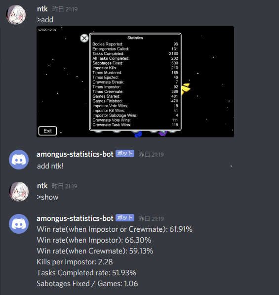

# amongus-statistics

Among Usのstatisticsのスクショを貼ると戦績っぽい値をいくつか返してくれるDiscord Bot．

\>addと>showの二つのコマンドを使用できる．

\>addとスクショ画像を同時に送ることでデータを読み取る．

\>showはいくつか引数を受け付けていて，--name usernameを用いると戦績を見たい人を指定することができる．

--userlistを用いると戦績を登録している人の一覧が見られる．

--rankを用いると登録している人のランキングを表示する，